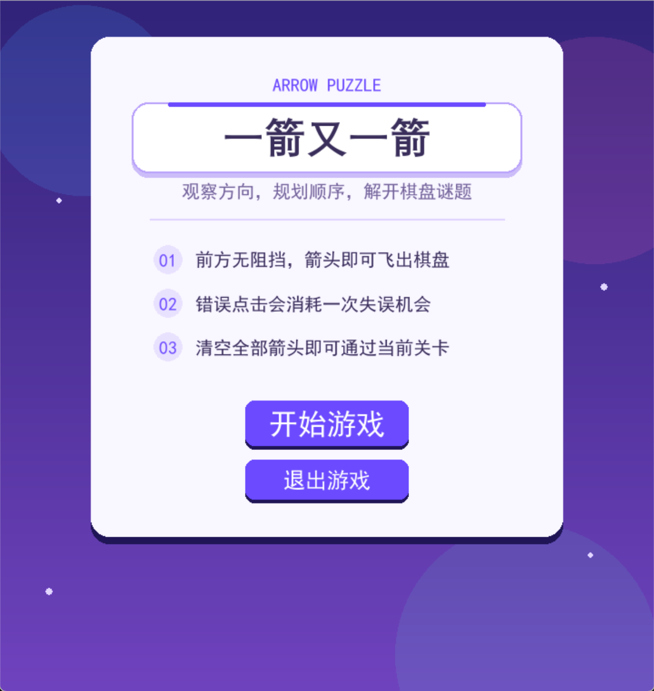
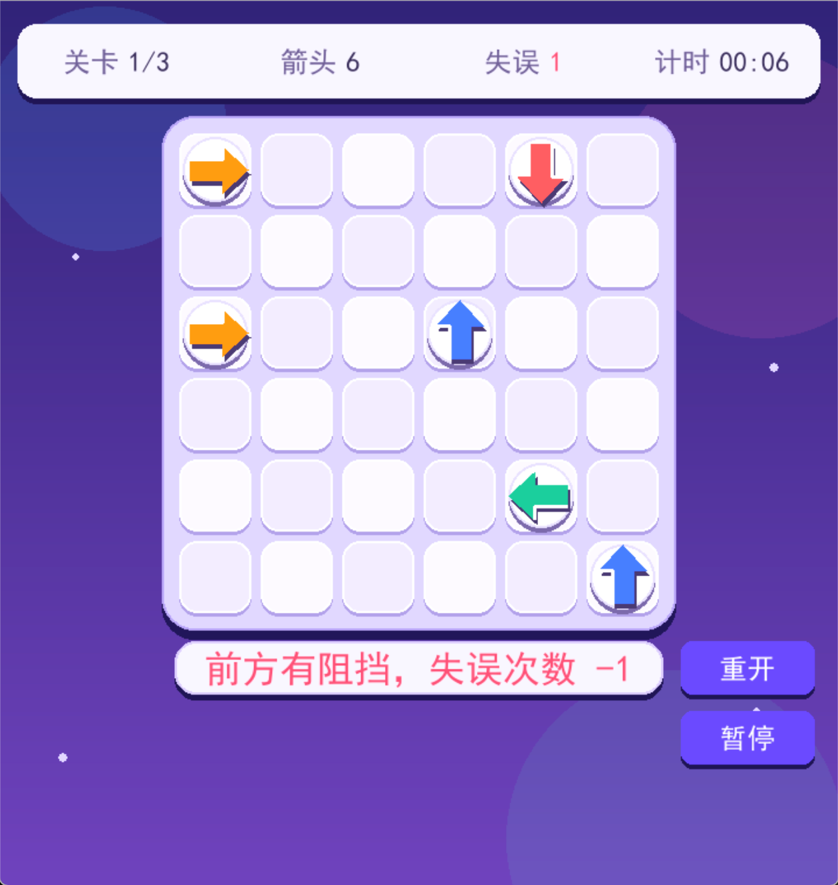
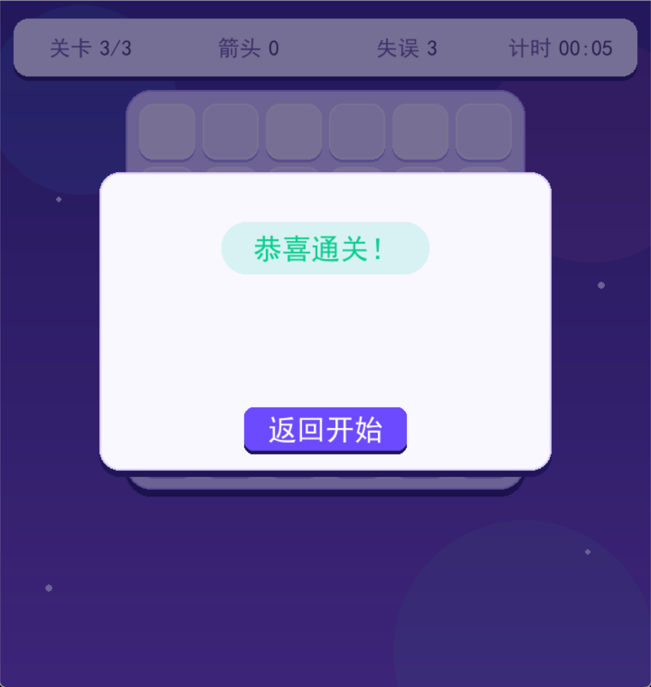
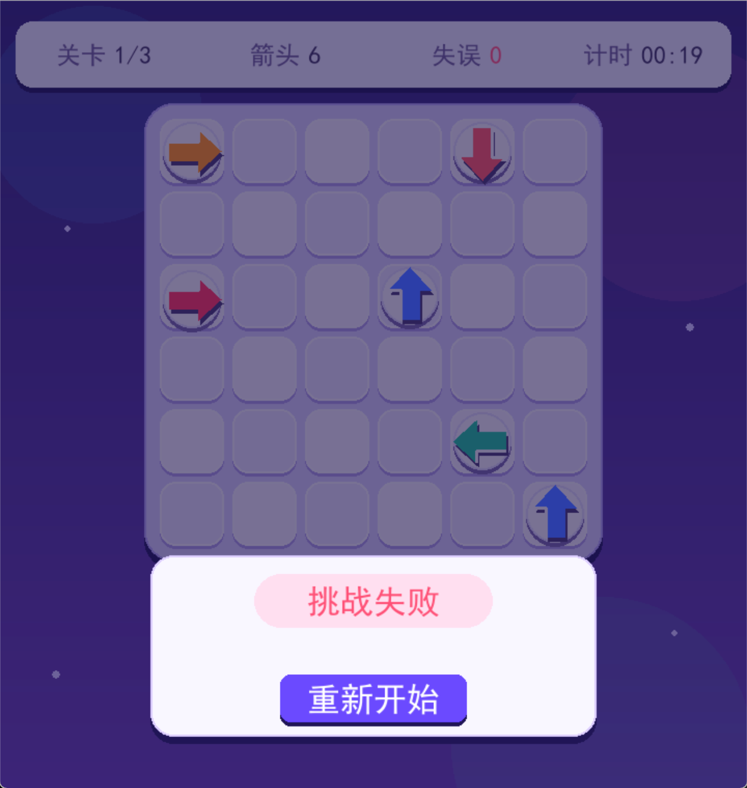

# 一箭又一箭

一款使用 Python 和 Pygame 开发的点击式箭头解谜小游戏。玩家需要观察箭头方向和相互阻挡关系，按照合适的顺序清空棋盘。

## 游戏规则

- 棋盘采用 `6 × 6` 网格；
- 箭头包含上、下、左、右四种方向；
- 点击箭头后，程序检查其前进方向到棋盘边界之间是否存在其他箭头；
- 前方没有阻挡时，箭头沿自身方向飞出棋盘并消失；
- 前方存在阻挡时，箭头前移后返回，同时晃动、变色，并消耗一次失误机会；
- 清除当前关卡全部箭头后通关；
- 失误次数耗尽后挑战失败，可以重新开始当前关卡；
- 完成前两关后进入下一关，完成第三关后返回开始菜单。

## 主要功能

- 正式的开始、游戏、通关和失败界面；
- 鼠标点击和空白格反馈；
- 四方向路径阻挡检测；
- 箭头飞出动画；
- 碰撞前移回弹、晃动和变色反馈；
- 剩余箭头数和失误次数显示；
- 3 个固定且可正常通关的关卡；
- 游戏内重新开始；
- 每关自动计时；
- 暂停、继续和暂停后退出至菜单；
- 开始界面退出游戏；
- 深紫渐变背景、圆角面板和徽章式箭头 UI。

## 实现思路

### 箭头与方向

每个箭头使用字典表示：

```python
{
    "row": 2,
    "col": 0,
    "direction": "right"
}
```

- `row`：箭头所在行；
- `col`：箭头所在列；
- `direction`：方向，可取 `up`、`down`、`left`、`right`。

当前关卡中尚未消除的箭头保存在列表中。箭头成功飞出后会从列表中移除，因此重新绘制棋盘时不再显示。

### 关卡数据

每个关卡由一个箭头列表表示，3 个关卡统一保存在 `LEVELS` 中。开始关卡或点击重开时，程序复制对应关卡的初始数据，同时恢复失误次数、计时和动画状态。

### 路径检测

路径检测会遍历当前棋盘中的其他箭头：

- 向上：检查同列且行号更小的箭头；
- 向下：检查同列且行号更大的箭头；
- 向左：检查同行且列号更小的箭头；
- 向右：检查同行且列号更大的箭头。

只要发现一个符合条件的箭头，就说明前方存在阻挡；遍历结束后没有找到阻挡，则允许箭头飞出。

### 程序结构

- `main.py`：程序入口，创建并运行游戏；
- `game.py`：关卡数据、游戏状态、路径检测、输入处理、动画和界面绘制；
- `test_game.py`：T01–T16 自动化测试。

## 开发环境

- Windows 10/11
- Anaconda / Miniconda
- Python 3.12.14
- Pygame 2.6.1

## 安装和运行

### 1. 创建 Anaconda 环境

```powershell
conda create -n se_homework2 python=3.12 -y
conda activate se_homework2
```

### 2. 安装依赖

进入 `SE_Homework2` 目录后执行：

```powershell
python -m pip install -r requirements.txt
```

### 3. 启动游戏

```powershell
python src\main.py
```

## 操作说明

- 在开始界面点击“开始游戏”进入第一关；
- 点击棋盘中的箭头进行消除；
- 点击“重开”恢复当前关卡；
- 点击“暂停”停止计时和棋盘操作；
- 暂停后可以继续游戏或退出至菜单；
- 在开始界面点击“退出游戏”关闭程序。

## 游戏画面

### 开始界面



### 游戏过程



### 通关界面



### 失败界面



## 自动化测试

项目使用 Python 内置 `unittest` 编写了 T01–T16 共 16 项自动化测试，覆盖路径判断、边界处理、通关失败、重新开始、关卡切换、暂停、退出、动画状态和计时重置。

运行测试：

```powershell
conda activate se_homework2
python -m unittest discover -s tests -v
```

当前测试结果：

```text
Ran 16 tests
OK
```

## 项目结构

```text
SE_Homework2/
├─ assets/              # 游戏截图和其他资源
├─ src/
│  ├─ main.py           # 程序入口
│  └─ game.py           # 游戏主体
├─ tests/
│  └─ test_game.py      # 自动化测试
├─ README.md
└─ requirements.txt
```
